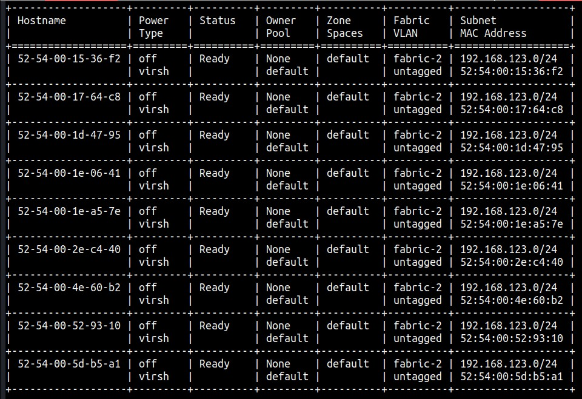
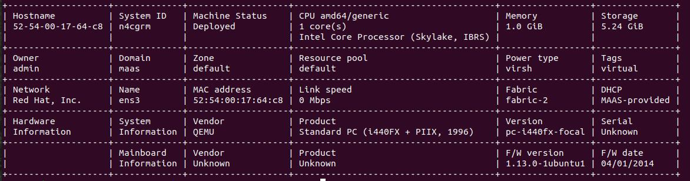

## MAAS CLI Tools

Just a little set of scripts that reproduce text versions of UI screens (like the Machine List, for example) on your terminal:   

### machine-list
**machine-list** prints a text machine list, very much like the MAAS UI machine list.  You can select machine status values to filter the output table.  It *also* prints details on individual machines, selected by hostname or system ID. It requires pip-ing the **tabulate** module.

Here's an example of the full machine list:



And an example of machine details:



Here's how you use **machine-list**:

```
machine-list profile ([hostname "hostname"] | [ready allocated deploying deploying])

machine-list will print:

	information for all machines (no options):
		"machine-list <return>"

	information for machines at different status values:
		"machine-list ready allocated..."
		(include as many statuses as you want)

	information for a specific hostname:
		"machine-list hostname 54-50-00-09-df-17

	information for a specific system ID:
		"machine-list system_id 54-50-00-09-df-17
```

Also useful for CLI-centric documentation.

As usual -- YMMV, y'all.